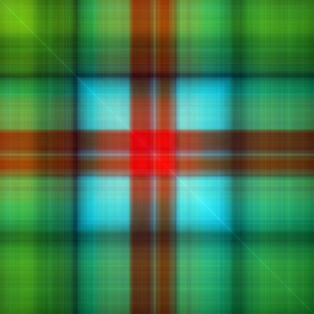
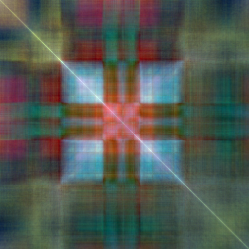

A number of people told me that it would be a good idea to bring some color motifs into our "matrix multiplication machines" framework.

In that framework we found that it is fruitful to interpret monochrome images as matrices and use matrix multiplication to make new images.

A number of people are saying that it would be nice to start exploring color motifs in this context.

The simplest way (`nov-23-exploration.ipynb` notebook, Julia 1.6.4, packages updated on Nov.23) is to decompose the image into red, green, and blue channels,
do matrix multiplication of the resulting matrices in each channel, and then join the result together
for a color image.

Straight multiplication:

When we normalize columns of the right matrix and rows of the left matrix:

A follow-up exploration (`nov-27-exploration.ipynb` notebook which has a much better code, functional and generally nice,
unlike the Nov 23 experiment).
